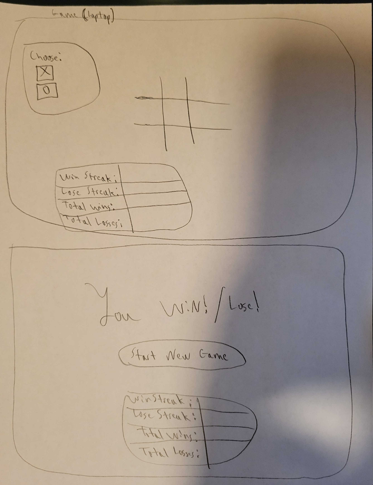

# Tit-Tac-Toe #
This application allows the user to play a game of Tic-Tac-Toe. The user will be able to create a unique profile, sign in, and sign out.

## Important Links ##

[Play game here.](https://angel-journey.github.io/Tika-Taka-Toe/)

## Planning ##

### User Stories ###

* As a game user, I want to click X/0 so that I can play as X/0.
* As a game user, I want to click on this part of the board > so that I can out manuver the computer.
* As a game user, I want to know when I have won so that I can know when to celebrate.
* As a game user, I want to know when the game is over so that I can start a new game.

### Wireframes ###
[Click here to view my wireframes online.](https://imgur.com/a/BeCpzRV)

#### Notes ####
* punt start new game as guest for now
* start as X always
* punt stats
* add change password in V2

## [License](LICENSE)

1. All content is licensed under a CC­BY­NC­SA 4.0 license.
1. All software code is licensed under GNU GPLv3. For commercial use or
    alternative licensing, please contact legal@ga.co.
